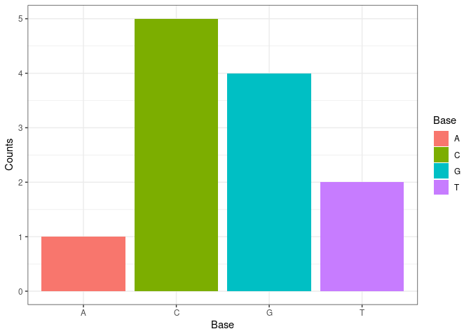

Group 17
================

# Package Group 17

# Table of Contents

-   [Introduction](#intro)
-   [Get started](#start)
    -   [Installation](#inst)
-   [Methods](#methods)
    -   [func1](#fun1)
    -   [func2](#fun2)
    -   [func3](#fun3)
    -   [func4](#fun4)
    -   [Plot occurence of Bases](#fun5)
-   [Session Info](#session)
-   [References](#ref)

# Introduction

This package is builed around the central dogma of Molecular Biology,
which describes the transfer of sequential information from DNA, RNA to
Amino Acids (Crick, 1970). With the package you are able to generate and
translate DNA, RNA and Amino-Acid Sequences. Further it enables you to
perform basic statistic on those sequences.

# Get started

The R-package `group17` can be found on
[Github](https://github.com/rforbiodatascience22/group_17_package).

## Installation

To install `group17` from GitHub repository run the code below:

``` r
library(devtools)
# install package from github
devtools::install_github("rforbiodatascience22/group_17_package")
```

## Load the library

``` r
library(group17)
```

    ## UUU UCU UAU UGU UUC UCC UAC UGC UUA UCA UAA UGA UUG UCG UAG UGG CUU CCU CAU CGU 
    ## "F" "S" "Y" "C" "F" "S" "Y" "C" "L" "S" "*" "*" "L" "S" "*" "W" "L" "P" "H" "R" 
    ## CUC CCC CAC CGC CUA CCA CAA CGA CUG CCG CAG CGG AUU ACU AAU AGU AUC ACC AAC AGC 
    ## "L" "P" "H" "R" "L" "P" "Q" "R" "L" "P" "Q" "R" "I" "T" "N" "S" "I" "T" "N" "S" 
    ## AUA ACA AAA AGA AUG ACG AAG AGG GUU GCU GAU GGU GUC GCC GAC GGC GUA GCA GAA GGA 
    ## "I" "T" "K" "R" "M" "T" "K" "R" "V" "A" "D" "G" "V" "A" "D" "G" "V" "A" "E" "G" 
    ## GUG GCG GAG GGG 
    ## "V" "A" "E" "G"

# Methods

## Function 1{#fun1} : F1_form_DNA

To form a string of DNA base “A”, “T”, “G”, “C” by random nucleotide
selection following target length(size), default is 1.

``` r
form_dna <- function(size = 1){
  random_dna1 <- sample(c("A", "T", "G", "C"), size = size, replace = TRUE)
  random_dna2 <- paste0(random_dna1, collapse = "")
  return(random_dna2)
}
```

## Function 2{#fun2} : F2_transcribe

To convert DNA base, “T” into “U” and getting mRNA as character.

``` r
transcribe <- function(DNA_seq){
  mRNA <- gsub("T", "U", DNA_seq)
  return(mRNA)
}
```

## Function 3{#fun3} : F3_get_codon

To convert mRNA sequence composing of “A”, “T”, “G”, “C” to condon like
“AUGC”as character.

``` r
get_codons <- function(mRNA_seq, start = 1){
  mRNA_sequences <- nchar(mRNA_seq)
  codons <- substring(mRNA_seq,
                      first = seq(from = start, to = mRNA_seq_len-3+1, by = 3),
                      last = seq(from = 3+start-1, to = mRNA_seq_len, by = 3))
  return(codons)
}
```

## Function 4{#fun4} : F4_translate

To use the data table “codonTable” to translate codons into amino acids
and then return it as a sting.

``` r
translate <- function(codons){
  amino_acid <- paste0(codon_table[codons], collapse = "")
  return(amino_acid)
}
```

## Plot occurence of Bases{#fun5} : F5_plot_base_occurence

To plot the occurence of Bases in a DNA, RNA or Amino Acid Sequence use
`plot_base_occurence()`

``` r
seq <- "ACGTCCCCGGGT"
plot_base_occurrence(sequence = seq)
```



``` r
plot_base_occurrence <- function(sequence){
  unique_bases <- sequence %>%
    stringr::str_split(pattern = stringr::boundary("character"), simplify = TRUE) %>%
    as.character() %>%
    unique()

  counts <- sapply(unique_bases, function(count_occurence) stringr::str_count(string = sequence, pattern =  count_occurence)) %>%
    as.data.frame()

  colnames(counts) <- c("Counts")
  counts[["Base"]] <- rownames(counts)

  plot <- counts %>%
    ggplot2::ggplot(ggplot2::aes(x = Base, y = Counts, fill = Base)) +
    ggplot2::geom_col() +
    ggplot2::theme_bw()

  return(plot)
}
```

## Session Info

``` r
sessionInfo()
```

    ## R version 4.1.3 (2022-03-10)
    ## Platform: x86_64-pc-linux-gnu (64-bit)
    ## Running under: Ubuntu 20.04.4 LTS
    ## 
    ## Matrix products: default
    ## BLAS:   /usr/lib/x86_64-linux-gnu/atlas/libblas.so.3.10.3
    ## LAPACK: /usr/lib/x86_64-linux-gnu/atlas/liblapack.so.3.10.3
    ## 
    ## locale:
    ##  [1] LC_CTYPE=C.UTF-8       LC_NUMERIC=C           LC_TIME=C.UTF-8       
    ##  [4] LC_COLLATE=C.UTF-8     LC_MONETARY=C.UTF-8    LC_MESSAGES=C.UTF-8   
    ##  [7] LC_PAPER=C.UTF-8       LC_NAME=C              LC_ADDRESS=C          
    ## [10] LC_TELEPHONE=C         LC_MEASUREMENT=C.UTF-8 LC_IDENTIFICATION=C   
    ## 
    ## attached base packages:
    ## [1] stats     graphics  grDevices utils     datasets  methods   base     
    ## 
    ## other attached packages:
    ##  [1] group17_0.1.0   magrittr_2.0.2  forcats_0.5.1   stringr_1.4.0  
    ##  [5] dplyr_1.0.8     purrr_0.3.4     readr_2.1.2     tidyr_1.2.0    
    ##  [9] tibble_3.1.6    ggplot2_3.3.5   tidyverse_1.3.1
    ## 
    ## loaded via a namespace (and not attached):
    ##  [1] tidyselect_1.1.1 xfun_0.29        haven_2.4.3      colorspace_2.0-2
    ##  [5] vctrs_0.3.8      generics_0.1.2   htmltools_0.5.2  yaml_2.2.2      
    ##  [9] utf8_1.2.2       rlang_1.0.1      pillar_1.7.0     withr_2.4.3     
    ## [13] glue_1.6.1       DBI_1.1.2        dbplyr_2.1.1     modelr_0.1.8    
    ## [17] readxl_1.3.1     lifecycle_1.0.1  munsell_0.5.0    gtable_0.3.0    
    ## [21] cellranger_1.1.0 rvest_1.0.2      evaluate_0.14    labeling_0.4.2  
    ## [25] knitr_1.37       tzdb_0.2.0       fastmap_1.1.0    fansi_1.0.2     
    ## [29] highr_0.9        broom_0.7.12     Rcpp_1.0.8       backports_1.4.1 
    ## [33] scales_1.1.1     jsonlite_1.7.3   farver_2.1.0     fs_1.5.2        
    ## [37] hms_1.1.1        digest_0.6.29    stringi_1.7.6    grid_4.1.3      
    ## [41] cli_3.1.1        tools_4.1.3      crayon_1.4.2     pkgconfig_2.0.3 
    ## [45] ellipsis_0.3.2   xml2_1.3.3       reprex_2.0.1     lubridate_1.8.0 
    ## [49] assertthat_0.2.1 rmarkdown_2.11   httr_1.4.2       rstudioapi_0.13 
    ## [53] R6_2.5.1         compiler_4.1.3

## References

CRICK, F. Central Dogma of Molecular Biology. Nature 227, 561–563
(1970). <https://doi.org/10.1038/227561a0>
